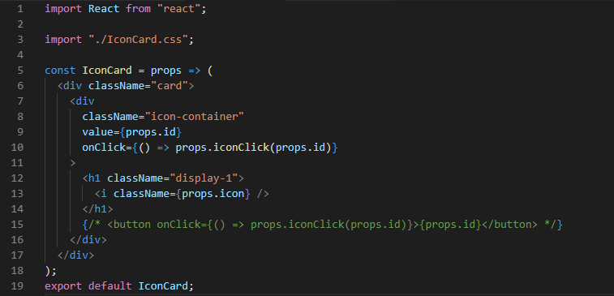
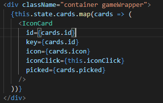
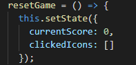
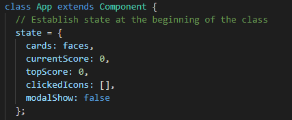

# Clicky - Icon - Game

### (My first react build!)

## Overview:

This is a memory game I built using React. It breaks up the user interface into components and manages them in such a way to respond to the user's clicks.

## [Play The Game](https://https://MCPolichette.github.io/clicky-game)

## Technologies used and credits:

### Thank you to:

1. React!
   The primary reason for this exercise.
2. Bootstrap
   CSS framework used to clean up and organize my divs better
3. Font Awesome
   Providing the Icons used in the clicky game.
4. Google Fonts
   Providing that awesome title text.
5. The background photograph was taken by <strong>Sandy Millar</strong>. And is available at [Unsplash](www.unsplash.com).

## What I've learned.

Although I've made better apps using other methods, I can see the value of using React for more complex and larger applications. All the code I wrote for setting up the icons could have been loaded with a lot more info than just their Id and source image.

React listens for specific state-changes and builds with Components.

## The future of this app and build:

1. Change Icons. I would like to have buttons that change the Icons used with an onClick function before or between games.

2. Modals. Currently this app uses alerts to signify the lose or win game events. I want to incorporate a modal that would have win/loss components depending on the triggers. I think this would be esspecially beneficial to understanding more of the complexities of React.

<!-- ADD LINK! -->

3. Motion. I saw [this link](https://medium.com/developers-writing/animating-the-unanimatable-1346a5aab3cd), and then the corresponding [github](https://github.com/joshwcomeau/react-flip-move) during the last tutorial and thought it would be awesome to implement <strong>React-Flip-Move</strong> to the action, causing the icons all to move independantly upon clicking. This turned out to be a great read, but the module is not up to date, and I'd like to learn how that and similar methods work. This app is a great foundation for that experimentation.
